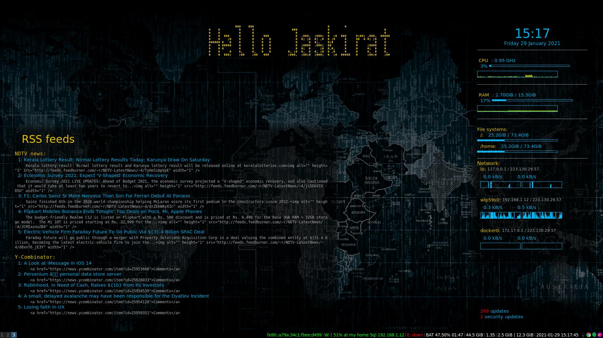

# i3-conky-desktop
An elegant and easy to setup conky theme. To use this, make sure that you have the following installed:
```shell
wget
i3wm
grep
whoami
conky
toilet
feh
python packages:
  feedparser
  subprocess
  netifaces
```

Add the following lines to your i3 config:

```shell
# restore the background image
exec --no-startup-id feh --bg-fill <PATH_TO_PACKAGE>/background/image.jpg

# Run conky for additional widgets
exec --no-startup-id <PATH_TO_PACKAGE>/main.sh <PATH_TO_PACKAGE>

# Might want to run compton for widgets window transparency
exec_always comptom
```

Example output:

